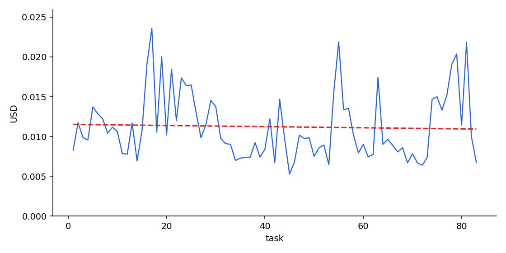

# Baseline shopping run — cost per task

Job: `webarena-shopping-baseline-full`  
Trial: `web-exploration__UvHkZnj`  
Agent: Harbor `pi` (fresh chat each step), `openai/gpt-5.6-luna`

If the agent were getting cheaper, cost would fall over the x-axis. A **flat line** means it is not learning on cost.

## Chart

Blue is USD per task. Red dashed line is the trend. Flat means no learning on cost.

## Verdict

**Not learning.** Cost is a noisy horizontal line.

| | |
|---|---|
| Scored tasks | 83 of 187 (stopped at `task-0300` Magento reset timeout) |
| Mean cost | $0.0112 |
| Total cost | $0.932 |
| Trend | -0.007 cents per task (≈ 0) |
| Mean cost, first 41 | $0.0116 |
| Mean cost, last 42 | $0.0108 |
| Correct, first 41 | 16 / 41 (39%) |
| Correct, last 42 | 5 / 42 (12%) |

The second half is slightly cheaper ($0.0108 vs $0.0116) but that is noise, not a learning curve. Accuracy went **down** (16/41 → 5/42). Later WebArena shopping tasks are harder; baseline has a new chat every step, so nothing in the prompt carries over.

## Per-task table

| # | task | cost USD | reward |
|---|---|---:|---:|
| 1 | `task-0021` | 0.0083 | 0 |
| 2 | `task-0022` | 0.0117 | 0 |
| 3 | `task-0023` | 0.0099 | 0 |
| 4 | `task-0024` | 0.0096 | 0 |
| 5 | `task-0025` | 0.0137 | 1 |
| 6 | `task-0026` | 0.0129 | 0 |
| 7 | `task-0047` | 0.0122 | 0 |
| 8 | `task-0048` | 0.0104 | 1 |
| 9 | `task-0049` | 0.0112 | 1 |
| 10 | `task-0050` | 0.0106 | 1 |
| 11 | `task-0051` | 0.0079 | 0 |
| 12 | `task-0096` | 0.0078 | 1 |
| 13 | `task-0117` | 0.0117 | 1 |
| 14 | `task-0118` | 0.0069 | 0 |
| 15 | `task-0124` | 0.0107 | 0 |
| 16 | `task-0125` | 0.0190 | 0 |
| 17 | `task-0126` | 0.0236 | 0 |
| 18 | `task-0141` | 0.0106 | 0 |
| 19 | `task-0142` | 0.0200 | 0 |
| 20 | `task-0143` | 0.0102 | 1 |
| 21 | `task-0144` | 0.0185 | 0 |
| 22 | `task-0145` | 0.0120 | 1 |
| 23 | `task-0146` | 0.0174 | 0 |
| 24 | `task-0147` | 0.0164 | 0 |
| 25 | `task-0148` | 0.0165 | 0 |
| 26 | `task-0149` | 0.0130 | 0 |
| 27 | `task-0150` | 0.0098 | 1 |
| 28 | `task-0158` | 0.0115 | 0 |
| 29 | `task-0159` | 0.0145 | 0 |
| 30 | `task-0160` | 0.0138 | 0 |
| 31 | `task-0161` | 0.0098 | 0 |
| 32 | `task-0162` | 0.0091 | 0 |
| 33 | `task-0163` | 0.0090 | 1 |
| 34 | `task-0164` | 0.0070 | 1 |
| 35 | `task-0165` | 0.0073 | 1 |
| 36 | `task-0166` | 0.0074 | 0 |
| 37 | `task-0167` | 0.0074 | 1 |
| 38 | `task-0188` | 0.0092 | 1 |
| 39 | `task-0189` | 0.0074 | 1 |
| 40 | `task-0190` | 0.0084 | 1 |
| 41 | `task-0191` | 0.0122 | 0 |
| 42 | `task-0192` | 0.0067 | 1 |
| 43 | `task-0225` | 0.0147 | 0 |
| 44 | `task-0226` | 0.0097 | 0 |
| 45 | `task-0227` | 0.0053 | 1 |
| 46 | `task-0228` | 0.0068 | 0 |
| 47 | `task-0229` | 0.0102 | 1 |
| 48 | `task-0230` | 0.0098 | 1 |
| 49 | `task-0231` | 0.0098 | 0 |
| 50 | `task-0232` | 0.0075 | 0 |
| 51 | `task-0233` | 0.0086 | 0 |
| 52 | `task-0234` | 0.0089 | 0 |
| 53 | `task-0235` | 0.0065 | 0 |
| 54 | `task-0238` | 0.0156 | 0 |
| 55 | `task-0239` | 0.0219 | 0 |
| 56 | `task-0240` | 0.0133 | 0 |
| 57 | `task-0241` | 0.0136 | 0 |
| 58 | `task-0242` | 0.0102 | 0 |
| 59 | `task-0260` | 0.0079 | 0 |
| 60 | `task-0261` | 0.0090 | 0 |
| 61 | `task-0262` | 0.0074 | 0 |
| 62 | `task-0263` | 0.0078 | 0 |
| 63 | `task-0264` | 0.0174 | 0 |
| 64 | `task-0269` | 0.0090 | 0 |
| 65 | `task-0270` | 0.0096 | 0 |
| 66 | `task-0271` | 0.0089 | 0 |
| 67 | `task-0272` | 0.0081 | 0 |
| 68 | `task-0273` | 0.0086 | 0 |
| 69 | `task-0274` | 0.0067 | 0 |
| 70 | `task-0275` | 0.0078 | 0 |
| 71 | `task-0276` | 0.0067 | 0 |
| 72 | `task-0277` | 0.0064 | 0 |
| 73 | `task-0278` | 0.0074 | 0 |
| 74 | `task-0279` | 0.0147 | 0 |
| 75 | `task-0280` | 0.0150 | 0 |
| 76 | `task-0281` | 0.0133 | 1 |
| 77 | `task-0282` | 0.0152 | 0 |
| 78 | `task-0283` | 0.0191 | 0 |
| 79 | `task-0284` | 0.0204 | 0 |
| 80 | `task-0285` | 0.0114 | 0 |
| 81 | `task-0286` | 0.0218 | 0 |
| 82 | `task-0298` | 0.0100 | 0 |
| 83 | `task-0299` | 0.0067 | 0 |
| 84 | `task-0300` | — | — | setup failed; Harbor stopped |
