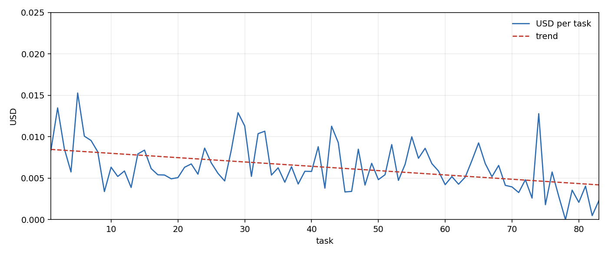
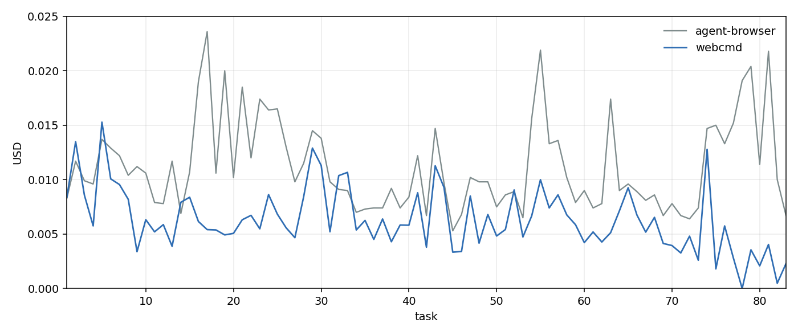

# Baseline shopping run — webcmd vs agent-browser

Job: `webarena-shopping-baseline-full-v2`  
Trial: `web-exploration__ZSDk67q`  
Agent: Harbor `pi` (fresh chat each step), `openai/gpt-5.6-luna`  
Browser: `webcmd` (local, uncommitted)

Same 83 Shopping tasks as [`report.md`](report.md) (`task-0021` … `task-0299`). That run used `agent-browser` and stopped on `task-0300` (Magento reset timeout). This job finished all 83 steps (~2.1 hours). `report.md` is unchanged.

If the agent were getting cheaper, cost would fall over the x-axis. A **flat line** means it is not learning on cost.

## Chart

Blue is USD per task. Red dashed line is the trend. Flat means no learning on cost.

Gray is the agent-browser run. Blue is webcmd on the same task order.

## Verdict

**Not learning.** The webcmd red line slants down. The agent-browser red line does not. That is still not learning.

Both runs miss the same later tasks (5/42). Agent-browser keeps spending ~$0.01–$0.02 on those misses, so its fit stays almost flat ($0.0115 → $0.0109). Webcmd’s misses are cheap (~$0.002–$0.005, and `task-0283` is $0 from a rate limit), so the right side of the cloud drops and the fit goes $0.0085 → $0.0042. Cheaper failures, not a better policy. A learning curve would keep (or raise) those 5/42 correct while cost fell. Baseline starts a new chat every step, so nothing can carry over.

On these 83 tasks webcmd is **cheaper** and **slightly more accurate**. That is a tool difference (fewer browser commands), not learning.

| | agent-browser (`report.md`) | webcmd (this run) |
|---|---|---|
| Scored tasks | 83 of 187 (stopped at `task-0300`) | 83 of 83 (finished) |
| Mean cost | $0.0112 | $0.0063 |
| Total cost | $0.932 | $0.525 |
| Trend (fit start → end) | $0.0115 → $0.0109 | $0.0085 → $0.0042 |
| Mean cost, first 41 | $0.0116 | $0.0073 |
| Mean cost, last 42 | $0.0108 | $0.0054 |
| Correct | 21 / 83 (25%) | 23 / 83 (28%) |
| Correct, first 41 | 16 / 41 (39%) | 18 / 41 (44%) |
| Correct, last 42 | 5 / 42 (12%) | 5 / 42 (12%) |
| Same-task wins | — | 20 both, 1 agent-browser only (`task-0281`), 3 webcmd only (`task-0023`, `task-0126`, `task-0226`) |

`task-0283` hit an OpenAI TPM rate limit and scored 0 with no model cost. Harbor still continued. Mean cost treats that step as $0.

## Per-task table (webcmd)

| # | task | cost USD | reward |
|---|---|---:|---:|
| 1 | `task-0021` | 0.0084 | 0 |
| 2 | `task-0022` | 0.0135 | 0 |
| 3 | `task-0023` | 0.0086 | 1 |
| 4 | `task-0024` | 0.0058 | 0 |
| 5 | `task-0025` | 0.0153 | 1 |
| 6 | `task-0026` | 0.0101 | 0 |
| 7 | `task-0047` | 0.0095 | 0 |
| 8 | `task-0048` | 0.0082 | 1 |
| 9 | `task-0049` | 0.0034 | 1 |
| 10 | `task-0050` | 0.0063 | 1 |
| 11 | `task-0051` | 0.0052 | 0 |
| 12 | `task-0096` | 0.0059 | 1 |
| 13 | `task-0117` | 0.0039 | 1 |
| 14 | `task-0118` | 0.0079 | 0 |
| 15 | `task-0124` | 0.0084 | 0 |
| 16 | `task-0125` | 0.0062 | 0 |
| 17 | `task-0126` | 0.0054 | 1 |
| 18 | `task-0141` | 0.0054 | 0 |
| 19 | `task-0142` | 0.0049 | 0 |
| 20 | `task-0143` | 0.0051 | 1 |
| 21 | `task-0144` | 0.0063 | 0 |
| 22 | `task-0145` | 0.0067 | 1 |
| 23 | `task-0146` | 0.0055 | 0 |
| 24 | `task-0147` | 0.0086 | 0 |
| 25 | `task-0148` | 0.0068 | 0 |
| 26 | `task-0149` | 0.0056 | 0 |
| 27 | `task-0150` | 0.0047 | 1 |
| 28 | `task-0158` | 0.0084 | 0 |
| 29 | `task-0159` | 0.0129 | 0 |
| 30 | `task-0160` | 0.0113 | 0 |
| 31 | `task-0161` | 0.0052 | 0 |
| 32 | `task-0162` | 0.0104 | 0 |
| 33 | `task-0163` | 0.0107 | 1 |
| 34 | `task-0164` | 0.0054 | 1 |
| 35 | `task-0165` | 0.0063 | 1 |
| 36 | `task-0166` | 0.0045 | 0 |
| 37 | `task-0167` | 0.0064 | 1 |
| 38 | `task-0188` | 0.0043 | 1 |
| 39 | `task-0189` | 0.0058 | 1 |
| 40 | `task-0190` | 0.0058 | 1 |
| 41 | `task-0191` | 0.0088 | 0 |
| 42 | `task-0192` | 0.0038 | 1 |
| 43 | `task-0225` | 0.0113 | 0 |
| 44 | `task-0226` | 0.0093 | 1 |
| 45 | `task-0227` | 0.0033 | 1 |
| 46 | `task-0228` | 0.0034 | 0 |
| 47 | `task-0229` | 0.0085 | 1 |
| 48 | `task-0230` | 0.0042 | 1 |
| 49 | `task-0231` | 0.0068 | 0 |
| 50 | `task-0232` | 0.0048 | 0 |
| 51 | `task-0233` | 0.0054 | 0 |
| 52 | `task-0234` | 0.0091 | 0 |
| 53 | `task-0235` | 0.0047 | 0 |
| 54 | `task-0238` | 0.0067 | 0 |
| 55 | `task-0239` | 0.0100 | 0 |
| 56 | `task-0240` | 0.0074 | 0 |
| 57 | `task-0241` | 0.0086 | 0 |
| 58 | `task-0242` | 0.0068 | 0 |
| 59 | `task-0260` | 0.0059 | 0 |
| 60 | `task-0261` | 0.0042 | 0 |
| 61 | `task-0262` | 0.0052 | 0 |
| 62 | `task-0263` | 0.0043 | 0 |
| 63 | `task-0264` | 0.0051 | 0 |
| 64 | `task-0269` | 0.0071 | 0 |
| 65 | `task-0270` | 0.0093 | 0 |
| 66 | `task-0271` | 0.0068 | 0 |
| 67 | `task-0272` | 0.0052 | 0 |
| 68 | `task-0273` | 0.0065 | 0 |
| 69 | `task-0274` | 0.0041 | 0 |
| 70 | `task-0275` | 0.0039 | 0 |
| 71 | `task-0276` | 0.0033 | 0 |
| 72 | `task-0277` | 0.0048 | 0 |
| 73 | `task-0278` | 0.0026 | 0 |
| 74 | `task-0279` | 0.0128 | 0 |
| 75 | `task-0280` | 0.0018 | 0 |
| 76 | `task-0281` | 0.0057 | 0 |
| 77 | `task-0282` | 0.0028 | 0 |
| 78 | `task-0283` | — | 0 | rate limit; Harbor continued |
| 79 | `task-0284` | 0.0036 | 0 |
| 80 | `task-0285` | 0.0021 | 0 |
| 81 | `task-0286` | 0.0040 | 0 |
| 82 | `task-0298` | 0.0005 | 0 |
| 83 | `task-0299` | 0.0023 | 0 |

## Same tasks, both runs

Costs in `report.md` are rounded to four decimals. Webcmd costs are from Harbor `cost_usd`.

| task | agent-browser $ | ab reward | webcmd $ | wc reward | winner |
|---|---:|---:|---:|---:|---|
| `task-0021` | 0.0083 | 0 | 0.0084 | 0 |  |
| `task-0022` | 0.0117 | 0 | 0.0135 | 0 |  |
| `task-0023` | 0.0099 | 0 | 0.0086 | 1 | webcmd only |
| `task-0024` | 0.0096 | 0 | 0.0058 | 0 |  |
| `task-0025` | 0.0137 | 1 | 0.0153 | 1 | both |
| `task-0026` | 0.0129 | 0 | 0.0101 | 0 |  |
| `task-0047` | 0.0122 | 0 | 0.0095 | 0 |  |
| `task-0048` | 0.0104 | 1 | 0.0082 | 1 | both |
| `task-0049` | 0.0112 | 1 | 0.0034 | 1 | both |
| `task-0050` | 0.0106 | 1 | 0.0063 | 1 | both |
| `task-0051` | 0.0079 | 0 | 0.0052 | 0 |  |
| `task-0096` | 0.0078 | 1 | 0.0059 | 1 | both |
| `task-0117` | 0.0117 | 1 | 0.0039 | 1 | both |
| `task-0118` | 0.0069 | 0 | 0.0079 | 0 |  |
| `task-0124` | 0.0107 | 0 | 0.0084 | 0 |  |
| `task-0125` | 0.0190 | 0 | 0.0062 | 0 |  |
| `task-0126` | 0.0236 | 0 | 0.0054 | 1 | webcmd only |
| `task-0141` | 0.0106 | 0 | 0.0054 | 0 |  |
| `task-0142` | 0.0200 | 0 | 0.0049 | 0 |  |
| `task-0143` | 0.0102 | 1 | 0.0051 | 1 | both |
| `task-0144` | 0.0185 | 0 | 0.0063 | 0 |  |
| `task-0145` | 0.0120 | 1 | 0.0067 | 1 | both |
| `task-0146` | 0.0174 | 0 | 0.0055 | 0 |  |
| `task-0147` | 0.0164 | 0 | 0.0086 | 0 |  |
| `task-0148` | 0.0165 | 0 | 0.0068 | 0 |  |
| `task-0149` | 0.0130 | 0 | 0.0056 | 0 |  |
| `task-0150` | 0.0098 | 1 | 0.0047 | 1 | both |
| `task-0158` | 0.0115 | 0 | 0.0084 | 0 |  |
| `task-0159` | 0.0145 | 0 | 0.0129 | 0 |  |
| `task-0160` | 0.0138 | 0 | 0.0113 | 0 |  |
| `task-0161` | 0.0098 | 0 | 0.0052 | 0 |  |
| `task-0162` | 0.0091 | 0 | 0.0104 | 0 |  |
| `task-0163` | 0.0090 | 1 | 0.0107 | 1 | both |
| `task-0164` | 0.0070 | 1 | 0.0054 | 1 | both |
| `task-0165` | 0.0073 | 1 | 0.0063 | 1 | both |
| `task-0166` | 0.0074 | 0 | 0.0045 | 0 |  |
| `task-0167` | 0.0074 | 1 | 0.0064 | 1 | both |
| `task-0188` | 0.0092 | 1 | 0.0043 | 1 | both |
| `task-0189` | 0.0074 | 1 | 0.0058 | 1 | both |
| `task-0190` | 0.0084 | 1 | 0.0058 | 1 | both |
| `task-0191` | 0.0122 | 0 | 0.0088 | 0 |  |
| `task-0192` | 0.0067 | 1 | 0.0038 | 1 | both |
| `task-0225` | 0.0147 | 0 | 0.0113 | 0 |  |
| `task-0226` | 0.0097 | 0 | 0.0093 | 1 | webcmd only |
| `task-0227` | 0.0053 | 1 | 0.0033 | 1 | both |
| `task-0228` | 0.0068 | 0 | 0.0034 | 0 |  |
| `task-0229` | 0.0102 | 1 | 0.0085 | 1 | both |
| `task-0230` | 0.0098 | 1 | 0.0042 | 1 | both |
| `task-0231` | 0.0098 | 0 | 0.0068 | 0 |  |
| `task-0232` | 0.0075 | 0 | 0.0048 | 0 |  |
| `task-0233` | 0.0086 | 0 | 0.0054 | 0 |  |
| `task-0234` | 0.0089 | 0 | 0.0091 | 0 |  |
| `task-0235` | 0.0065 | 0 | 0.0047 | 0 |  |
| `task-0238` | 0.0156 | 0 | 0.0067 | 0 |  |
| `task-0239` | 0.0219 | 0 | 0.0100 | 0 |  |
| `task-0240` | 0.0133 | 0 | 0.0074 | 0 |  |
| `task-0241` | 0.0136 | 0 | 0.0086 | 0 |  |
| `task-0242` | 0.0102 | 0 | 0.0068 | 0 |  |
| `task-0260` | 0.0079 | 0 | 0.0059 | 0 |  |
| `task-0261` | 0.0090 | 0 | 0.0042 | 0 |  |
| `task-0262` | 0.0074 | 0 | 0.0052 | 0 |  |
| `task-0263` | 0.0078 | 0 | 0.0043 | 0 |  |
| `task-0264` | 0.0174 | 0 | 0.0051 | 0 |  |
| `task-0269` | 0.0090 | 0 | 0.0071 | 0 |  |
| `task-0270` | 0.0096 | 0 | 0.0093 | 0 |  |
| `task-0271` | 0.0089 | 0 | 0.0068 | 0 |  |
| `task-0272` | 0.0081 | 0 | 0.0052 | 0 |  |
| `task-0273` | 0.0086 | 0 | 0.0065 | 0 |  |
| `task-0274` | 0.0067 | 0 | 0.0041 | 0 |  |
| `task-0275` | 0.0078 | 0 | 0.0039 | 0 |  |
| `task-0276` | 0.0067 | 0 | 0.0033 | 0 |  |
| `task-0277` | 0.0064 | 0 | 0.0048 | 0 |  |
| `task-0278` | 0.0074 | 0 | 0.0026 | 0 |  |
| `task-0279` | 0.0147 | 0 | 0.0128 | 0 |  |
| `task-0280` | 0.0150 | 0 | 0.0018 | 0 |  |
| `task-0281` | 0.0133 | 1 | 0.0057 | 0 | agent-browser only |
| `task-0282` | 0.0152 | 0 | 0.0028 | 0 |  |
| `task-0283` | 0.0191 | 0 | — | 0 |  |
| `task-0284` | 0.0204 | 0 | 0.0036 | 0 |  |
| `task-0285` | 0.0114 | 0 | 0.0021 | 0 |  |
| `task-0286` | 0.0218 | 0 | 0.0040 | 0 |  |
| `task-0298` | 0.0100 | 0 | 0.0005 | 0 |  |
| `task-0299` | 0.0067 | 0 | 0.0023 | 0 |  |
